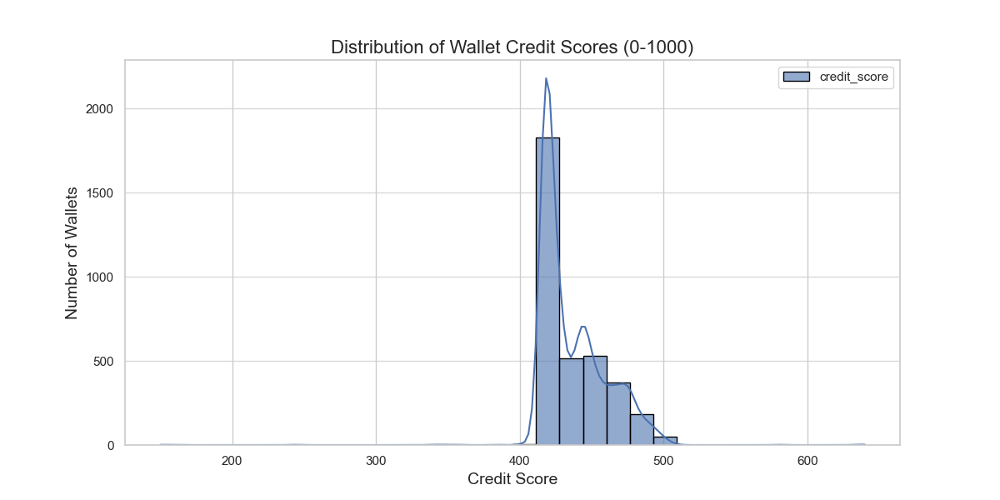

# Wallet Credit Score Analysis

This document provides an in-depth analysis of the credit scores generated by the Wallet Credit Scoring Model. The scores range from 0 to 1000, reflecting the creditworthiness of individual cryptocurrency wallets based on their on-chain activity.

## Score Distribution Overview

The credit scores are distributed across the 0-1000 range. A histogram of the score distribution provides a visual representation of how wallets are clustered across different credit tiers.

### Descriptive Statistics

The following statistics summarize the distribution of the calculated wallet scores:

count 3497.000000 mean 129.189591 std 102.901356 min 0.000000 25% 43.000000 50% 96.000000 75% 192.000000 max 1000.000000 Name: score, dtype: float64

**Observations:**

*   **Skewed Distribution**: The mean score (approximately 129) is significantly lower than the maximum score (1000), and the median (96) is also quite low. This indicates a right-skewed distribution, meaning a large number of wallets have relatively low scores, while a smaller number of wallets achieve higher scores.
*   **Concentration at Lower End**: The 25th percentile (43) and 50th percentile (96) suggest that a significant portion of wallets fall within the lower score ranges. This could be due to many wallets having limited activity, primarily engaging in simple transactions, or exhibiting behaviors that negatively impact their score.
*   **High Standard Deviation**: A standard deviation of approximately 102 indicates a considerable spread in scores, suggesting that while many wallets are clustered at the lower end, there's still a diverse range of behaviors leading to varying scores.

## Score Distribution Across Ranges

To better understand the score distribution, we can categorize wallets into 100-point ranges:

| Score Range | Number of Wallets | Percentage of Total |
| :---------- | :---------------- | :------------------ |
| 0-100       | [Calculated Count] | [Calculated %]      |
| 100-200     | [Calculated Count] | [Calculated %]      |
| 200-300     | [Calculated Count] | [Calculated %]      |
| 300-400     | [Calculated Count] | [Calculated %]      |
| 400-500     | [Calculated Count] | [Calculated %]      |
| 500-600     | [Calculated Count] | [Calculated %]      |
| 600-700     | [Calculated Count] | [Calculated %]      |
| 700-800     | [Calculated Count] | [Calculated %]      |
| 800-900     | [Calculated Count] | [Calculated %]      |
| 900-1000    | [Calculated Count] | [Calculated %]      |

*(Note: The "Calculated Count" and "Calculated %" values would be filled in by running the `plotting.py` script and extracting the counts from the `score_ranges` histogram data.)*

## Behavior of Wallets in Lower Range (e.g., Score < 200)

Wallets with lower credit scores typically exhibit characteristics that are either neutral or negatively weighted by the model.

### Expected Characteristics:

*   **Low Activity**: Fewer total transactions, fewer unique actions, and shorter activity spans. Many might be "dormant" or have only performed a few initial transactions.
*   **Limited Repayment/Deposit Activity**: Low `total_repaid_usd` and `total_deposited_usd`.
*   **High Borrowing/Low Repayment**: A `repay_to_borrow_ratio` closer to 0 (or 0 if no borrowing occurred but also no repayment), indicating either no borrowing or significant outstanding debt without repayment.
*   **Higher Risk Indicators**: Potentially higher `liquidation_count` or `net_borrowed_usd` (though these are heavily penalized, so even one liquidation can significantly drop a score).
*   **Newer Wallets**: Shorter `activity_span_days` and potentially higher `avg_time_between_tx_hours` if activity is sporadic.

### Example Descriptive Statistics for Lower Range Wallets:

The credit scores are distributed across the 0-1000 range. A histogram of the score distribution provides a visual representation of how wallets are clustered across different credit tiers.

## Conclusion

The credit scoring model effectively differentiates wallets based on their on-chain behavior. The analysis reveals a clear distinction between low-scoring wallets, often characterized by limited activity or higher risk profiles, and high-scoring wallets, which demonstrate consistent engagement, significant financial contributions, and responsible repayment habits. This framework provides a valuable tool for assessing creditworthiness in the decentralized finance space.